# Notification d'effets indésirables sur produits cosmétiques Web Service

## Installation

### Étape 1, cloner le dépôt

```sh
git clone git@github.com:yoannfleurydev/notif-cosmo-ei-server.git # via ssh
git clone https://github.com/yoannfleurydev/notif-cosmo-ei-server.git # via http

cd notif-cosmo-ei-server
```

### Étape 2, créer la base de données

```sql
CREATE DATABASE notifcosmoei
```

N'oubliez pas de créer un utilisateur et lui donner les droits suffisant sur cette base 
de données. Les données seront à fournir par la suite dans le fichier de configuration
de l'application.

### Étape 3, configurer l'application

```sh
cp src/main/resources/application.properties.dist src/main/resources/application.properties
vim src/main/resources/application.properties
```

Changez les paramètres en fonction de votre besoin. Changez le paramètre 
`notif-cosmo-ei.api-check.check-region-code` à `false` si vous n'avez pas 
ajouté le certificat SSL nécessaire pour contacter l'API du gouvernement 
français. Dans le cas où vous souhaitez tout de même vérifier le code des 
régions, [la documentation](#validité-des-données) pour installer le 
certificat est disponible un peu plus bas.

### Étape 4, lancer le serveur

```sh
./mvnw spring-boot:run # sous GNU/Linux
mvnw.cmd spring-boot:run # sous Windows
```

## Technologies

Utilisation des technologies suivantes :

* Java 8 (utilisation de lambda, donc impossible en dessous)
* Spring Boot
* Angular (nouvelle version, utilisation de web component, utilisez Chrome, 
Firefox dans leurs dernières versions)

## API

* https://geo.api.gouv.fr

## Routes

### Inscription et connexion

**POST /user/signup**

```json
{
    "userName" : "yoannfleurydev",
    "email" : "yoann.fleury@example.com",
    "firstName" : "Yoann",
    "lastName" : "Fleury",
    "password" : "azerty",
    "role" : "USER"
}
```

**POST /user/login**
```json
{
    "name" : "yoannfleurydev",
    "password" : "azerty"
}
```

**NOTE :** Ces routes renvoient un token qui permet d'identifier l'utilisateur 
en cours. Ce token est à envoyer pour les requêtes en `POST` dans le *header* 
HTTP `Authorization` avec comme valeur `Bearer le_token`. Ceci permet au web 
service de reconnaitre l'utilisateur. C'est ce qu'on appelle un JSON Web Token
ou JWT.

### Produits

**GET /products** : retourne tous les produits disponible en base de données.

**GET /products/{id}** : retourne l'élément d'index `id`.

**POST /products** : crée un produit en base de données et le retourne si tout 
se passe bien. Il est possible de passer en même temps des index d'ingrédients 
existant déjà en base de données. Si un index d'ingrédient n'existe pas, l'ajout
du produit sera annulé.

```json
{
	"name" : "Name",
	"ingredients" : [
		1
	]
}
```
**PUT /products/{id}** : met à jour le produit d'index `id` et le retourne si 
tout se passe bien.

```json
{
	"name": "Name"
}
```

**DELETE /products/{id}** : supprime le produit d'index `id`.

**GET /products/{id}/effects** ou **GET /products/{id}/notifications** : 
retourne tous les effets et notifications en rapport avec le produit d'index 
`id`.

```json
{
	"product": {
		"id": 1,
		"name": "Shampoing",
		"ingredients": [
			2,
			3
		]
	},
	"effects": [
		{
			"id": 1,
			"description": "Gratte",
			"level": "UNKNOWN"
		}
	],
	"notifications": [
		{
			"id": 2,
			"user": 1,
			"code": "28",
			"date": 1484054514000,
			"effects": [
				1
			],
			"products": [
				1
			]
		}
	]
}
```

### Ingrédients

**GET /ingredients** : retourne tous les ingrédients stockés en base de données.

**GET /ingredients/{id}** : retourne l'ingrédients d'index `id`.

**POST /ingredients** : crée un ingrédient en base de données et le retoune si 
tout se passe bien. 

```json
{
    "name": "Aqua"
}
```

**PUT /ingredients/{id}** : met à jour l'ingrédient d'index `id` et le retourne
si tout se passe bien.

```json
{
    "name": "Aqua"
}
```

**DELETE /ingredients/{id}** : supprime l'ingrédient d'index `id`.

### Effets

**GET /effects** : retourne tous les effets stockés en base de données.

**GET /effects/{id}** : retourne l'effet d'index `id`.

**GET /effects/most\_reported** : retourne tous les effets par nombre de 
déclarations.

```json
[
	{
		"id": 2,
		"description": "Ca gratte",
		"level": "UNKNOWN",
		"nbNotifications": 9
	},
	{
		"id": 1,
		"description": "Ouille",
		"level": "UNKNOWN",
		"nbNotifications": 5
	}
]
```

**GET /effects/heaviest** : retourne tous les effets, classé par poids selon 
le rôle de l'utilisateur pour chaque déclaration.

L'exemple ci-dessous reprend celui juste au-dessus avec une déclaration de 
médecin en plus pour l'effet **Ouille**, ce qui ajoute un poids de 5 et passe 
donc au dessus de l'effet **Ca gratte**.

```json
[
	{
		"id": 1,
		"description": "Ouille",
		"level": "UNKNOWN",
		"nbNotifications": 6
	},
	{
		"id": 2,
		"description": "Ca gratte",
		"level": "UNKNOWN",
		"nbNotifications": 9
	}
]
```

**POST /effects** : crée un effet en base de données et le retourne si tout se 
passe bien.

**PUT /effects/{id}** : met à jour l'effet d'index `id` et le retourne si tout 
se passe bien.

**DELETE /effects/{id}** : supprime l'effet d'index `id`.

### Notifications

**GET /notifications** : retourne toutes les notifications stockées en base de données.

**GET /notifications/myself** : retourne toutes les notifications déposées par moi.

**GET /notifications/{id}** : permet de récupérer la notification correspendante à 
l'index passé en paramètre

**POST /notifications** : permet de poster une notification

**PUT /notifications/{id}** : permet de mettre à jour la notification d'index `id`

**DELETE /notifications/{id}** : permet de supprimer la notification d'index `id`

### Recherche

Il est possible de rechercher des termes sur des champs précis des objets. 
Les recherches sont insensibles à la casse. En voici la liste :

> `recherche` étant le terme à rechercher.

* Recherche sur le **nom** d'un ingrédient : `GET /ingredients/search?value=recherche`,
* Recherche sur le **nom** d'un produit : `GET /products/search?value=recherche`
* Recherche sur la **description** d'un effet : `GET /effect/search?value=recherche`

## Pagination

Il est possible de paginer sur les routes de type `GET` sur `/entities`.
Les paramètres sont les suivants :

* **page** `int` (défaut=0) : la page que l'on souhaite
* **limit** `int` (défaut=20) : le nombre d'entité par page
* **direction** `string` (défaut=ASC, valeurs=ASC|DESC) : le sens du tri
* **property** `string` (défaut=id) : la propriété à trier

Un exemple de pagination peut être : `/ingredients?page=2&limit=10&property=name`

## Architecture logique

Notre architecture se veut plus complexe qu'un simple Web Service avec Spring.
Notre code est plus vaste qu'un simple projet, mais permet d'avoir le contrôle 
sur les données que renvoie notre Web Service grâce à l'abstraction 
supplémentaire des **DTO** (Data Transfer Object). Grâce à cette abstraction, 
nous choisissons ce qui est envoyé ou non par notre API. Les `Mappers` 
permettent de mapper les champs entre l'entité et le `DTO`. Utiliser un 
framework c'est bien pour la vitesse de développement, mais en avoir le contrôle
est encore mieux, même si il faut perdre un peu de temps pour ça.

Notre Web Service est protégé par une authentification par JWT (Json Web Token)
qui assure l'intégrité de la connexion et qui permet de garder un Web Service
sans état.

### Diagrammes de l'architecture logicielle

**Package principal:**

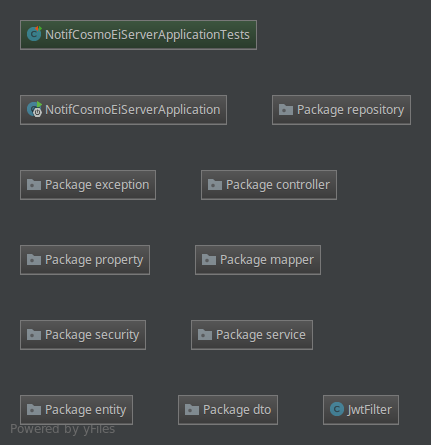

**Contrôleurs :**

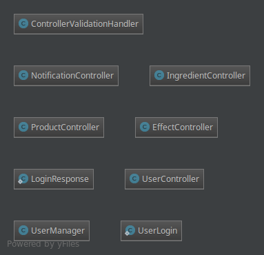

**DTO :**

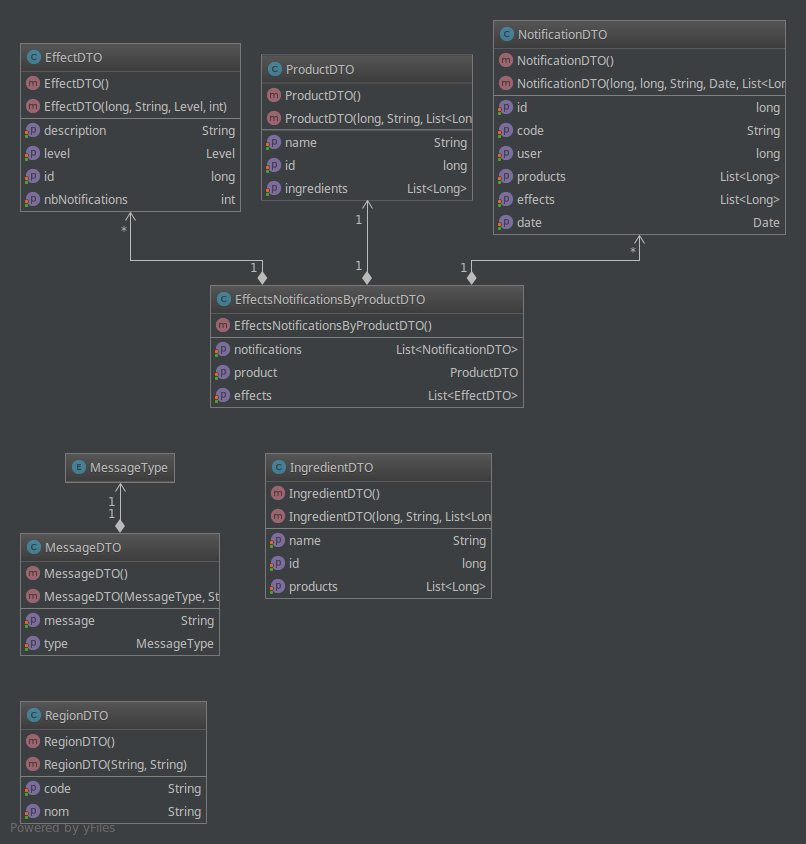

**Entité :**

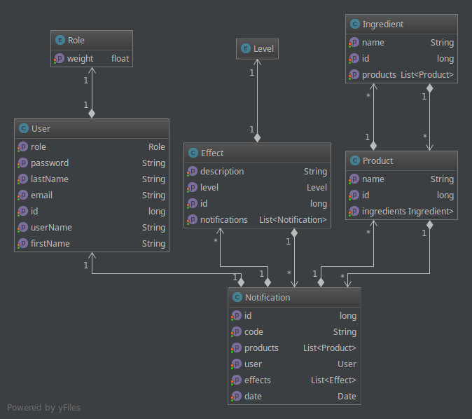

**Exception :**

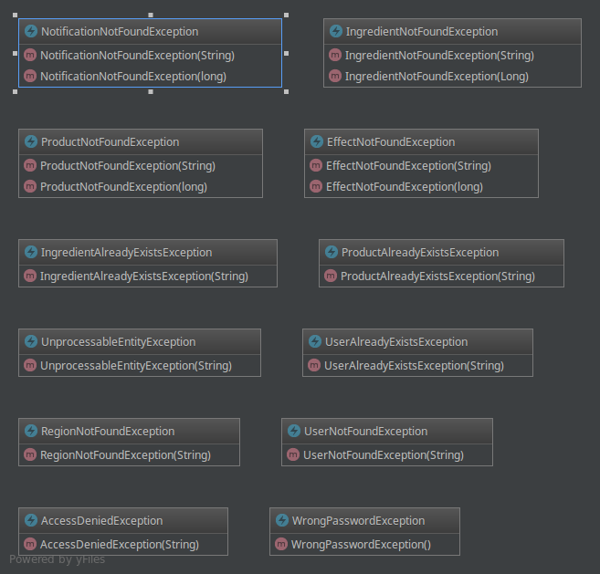

**Mapper :**

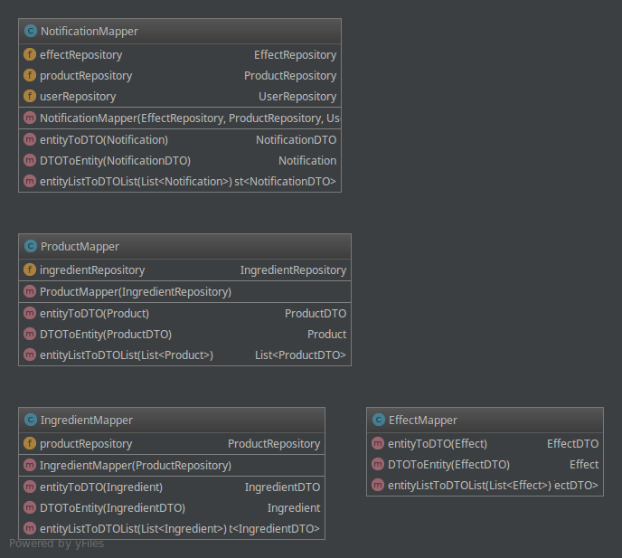

**Propriétés de l'application :**

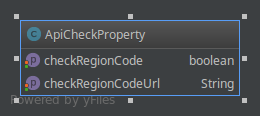

**Repository :**

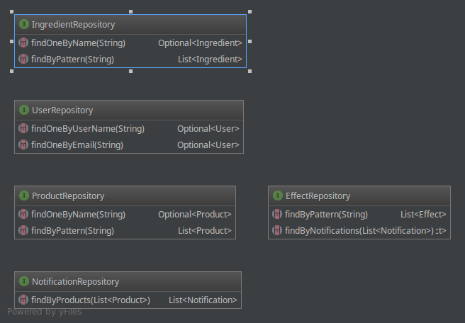

**Sécurité :**

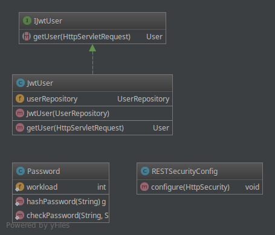

**Service :**
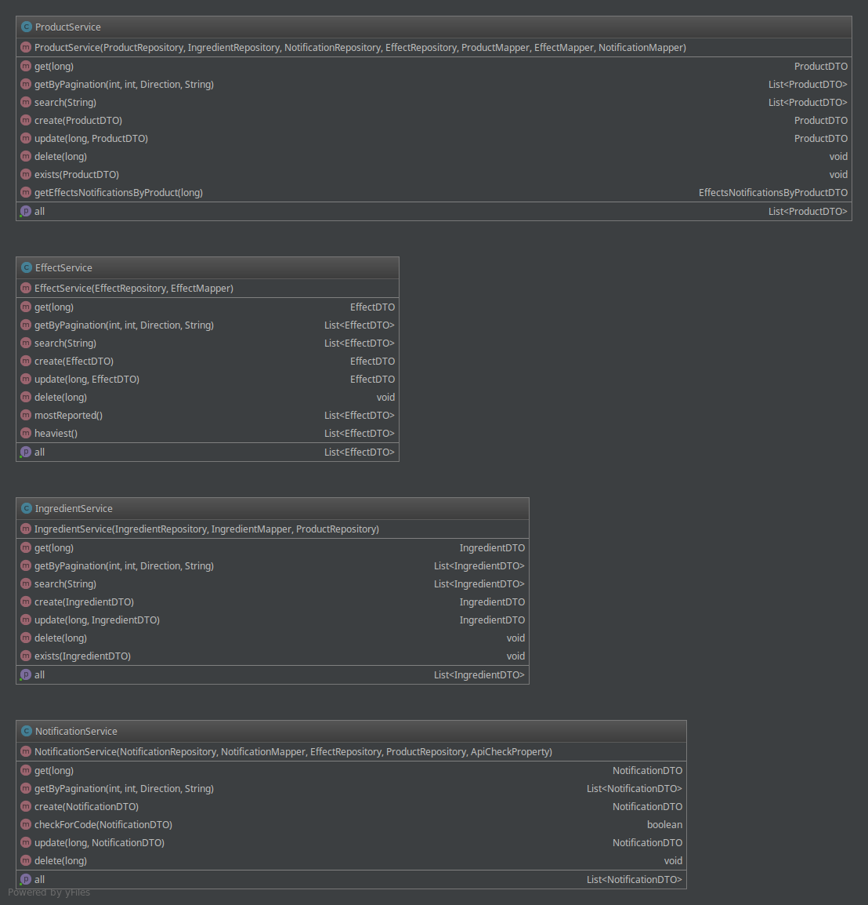

### Base de données

Schema de la base de données 

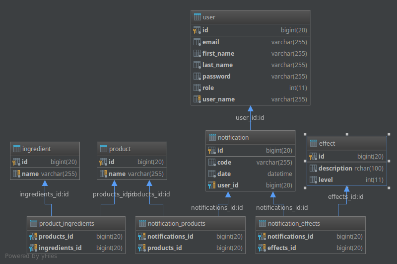

## Validité des données

Afin de garantir un maximum la validité des données, nous faisons appel au web 
service du gouvernement permettant de récupérer les régions françaises.

Pour pouvoir contacter cette API depuis le serveur, il faut que le certificat 
SSL de l'API en question soit dans les certificats connus par Java. Ce 
[lien](http://magicmonster.com/kb/prg/java/ssl/pkix_path_building_failed.html) 
contient la démarche.

Il est possible de désactiver cette fonctionnalité grâce à l'option 
`notif-cosmo-ei.api-check.check-region-code` qui est un booléen. A `false`, le 
code de l'application ne vérifira pas le code des régions. 

La vérification du code des régions prends également du temps. Dans le cas ou 
la communication entre le serveur et le client est longue, nous conseillons la 
désactivation de cette option.
